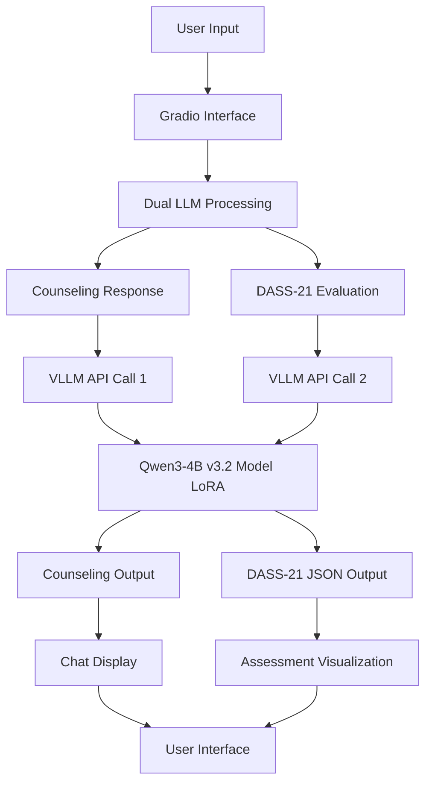

# 🧠 Multilingual Mental Health Chatbot with DASS-21 Assessment

A comprehensive Gradio-based chatbot application that integrates your fine-tuned Qwen3-4B v3.2 model with real-time DASS-21 psychological assessment.

## 🌟 Features

- **Dual LLM Calls**: 
  - Mental health counseling responses
  - Automatic DASS-21 psychological assessment
- **Multilingual Support**: English, Vietnamese, Arabic, Mandarin, Cantonese
- **Real-time Visualization**: Interactive DASS-21 assessment charts
- **Privacy-Focused**: On-premise deployment via VLLM
- **Cultural Sensitivity**: Trained on culturally-diverse datasets

## 🚀 Quick Start

### 1. Install Dependencies

```bash
pip install -r chatbot_requirements.txt
```

### 2. Download Model and Configure Your Model

Download model from here: https://1drv.ms/f/s!Aux-k3Gku6y6spVl4-Edg4kJRfxk0Q?e=5RnppU

Edit `config.py` to point to your model:

```python
# Update these paths
BASE_MODEL_PATH = "unsloth/Qwen3-4B"
LORA_ADAPTER_PATH = "trained_model_v3_2_grpo" # Or any other model you prefer
```

### 3. Run the Application

**Option A: Automated Setup**
```bash
./run_chatbot.sh
```

**Option B: Manual Setup**

Start VLLM server:
```bash
python -m vllm.entrypoints.openai.api_server \
    --model unsloth/Qwen3-4B \
    --enable-lora \
    --lora-modules qwen3-lora=trained_model_v3_2_grpo \
    --port 8000 \
    --host 0.0.0.0 \
    --trust-remote-code
```

Start Gradio app:
```bash
python gradio_chatbot_app.py
```

### 4. Access the Application

Open your browser and go to: `http://localhost:7860`

## 🏗️ Architecture



## 📊 DASS-21 Assessment

The application automatically evaluates user messages using the Depression, Anxiety, Stress Scales (DASS-21):

### Scoring Scale
- **0**: Never
- **1**: Sometimes  
- **2**: Often
- **3**: Almost Always

### Severity Levels

**Depression:**
- Normal: 0-9
- Mild: 10-13
- Moderate: 14-20
- Severe: 21-27
- Extremely Severe: 28+

**Anxiety:**
- Normal: 0-7
- Mild: 8-9
- Moderate: 10-14
- Severe: 15-19
- Extremely Severe: 20+

**Stress:**
- Normal: 0-14
- Mild: 15-18
- Moderate: 19-25
- Severe: 26-33
- Extremely Severe: 34+

## 🔧 Configuration

### Key Configuration Options

```python
# config.py
VLLM_BASE_URL = "http://localhost:8000"
MODEL_NAME = "unsloth/Qwen3-4B"
GRADIO_PORT = 7860
MAX_TOKENS_COUNSELING = 1024
MAX_TOKENS_DASS21 = 4000
```

### VLLM Server Options

For GPU deployment:
```bash
--gpu-memory-utilization 0.8
--max-num-seqs 256
--disable-log-stats
```

For CPU deployment:
```bash
--device cpu
--dtype float16
```

## 🎯 Usage Examples

### Example Conversation

**User**: "i am and have been battling depression since throughout the year i ve been on anti depressive pretty much the whole time just when i feel like i m maybe stabilizing or dare i say it getting better i go crashing back down to the bottomless pit of sadness right now i m on vacation in a tropical island a dream for me yet here i am constantly emotional and unable to find joy ha anyone ever gotten over depression for good or will this plague me until the end", "answer": "Depression is a complex condition that can manifest differently for each person, and recovery timelines can vary significantly. While some people may experience lasting remission from depression with treatment, others may need ongoing support to manage their symptoms. The key to long-term relief often involves a combination of therapy, medication, lifestyle changes, and self-care practices. Recovery also often requires patience and persistence as you explore different strategies that work best for you. It's important to remember that everyone's journey is unique, and progress may not always be linear. As you continue your personal growth and healing, consider focusing on self-compassion, finding healthy coping mechanisms, and building a strong support network. I'm here to offer guidance and encouragement along the way."

**Chatbot**: *Provides empathetic counseling response*

**DASS-21 Assessment**: 
- Depression: 18 (Moderate)
- Anxiety: 4 (Normal)
- Stress: 12 (Normal)

## 🛠️ Customization

### Modifying Assessment Criteria

1. Update the `dass21_prompt` in the `MentalHealthChatbot` class
2. Adjust severity thresholds in `create_dass21_visualization()`

### UI Customization

1. Modify CSS in the Gradio `Blocks` definition
2. Adjust colors and themes in the plotly visualization
3. Update markdown content for branding

## 📁 File Structure

```
📦 Mental Health Chatbot
├── 📄 gradio_chatbot_app.py      # Main application
├── 📄 config.py                  # Configuration settings
├── 📄 chatbot_requirements.txt   # Python dependencies
├── 📄 run_chatbot.sh            # Setup and run script
├── 📄 README_CHATBOT.md         # This file
└── 📊 logs/                     # Application logs (optional)
```

## 🔒 Privacy & Security

- **On-Premise**: Runs entirely on your infrastructure
- **No External APIs**: All processing via local VLLM server
- **Conversation Privacy**: Optional conversation logging (disabled by default)
- **DASS-21 Data**: Assessment results stored only in memory during session

## 🧪 Testing

### Test VLLM Connection
```bash
curl http://localhost:8000/health
```

### Test Model Inference
```bash
curl -X POST http://localhost:8000/v1/completions \
  -H "Content-Type: application/json" \
  -d '{
    "model": "unsloth/Qwen3-4B-v3.2",
    "prompt": "Hello, how are you?",
    "max_tokens": 50
  }'
```

## 🐛 Troubleshooting

### Common Issues

**VLLM Server Won't Start**
- Check GPU memory availability
- Verify model path is correct
- Ensure CUDA is properly installed

**Gradio App Connection Error**
- Verify VLLM server is running (`curl http://localhost:8000/health`)
- Check firewall settings
- Confirm port availability

**DASS-21 Assessment Not Working**
- Check VLLM response format
- Verify JSON parsing in evaluation function
- Review model output for correct format

**Poor Model Responses**
- Verify you're using the correct v3.2 model
- Check LoRA adapter path
- Review model loading parameters

## 📈 Performance Optimization

### For Better Response Times
- Use GPU acceleration
- Increase `--gpu-memory-utilization`
- Reduce `max_tokens` for faster inference

### For Better Accuracy
- Increase `max_tokens` for DASS-21 evaluation
- Adjust `temperature` for more/less creative responses
- Fine-tune prompts for your specific use case

## 🤝 Support

For issues related to:
- **Model Training**: Refer to the main project README
- **VLLM Setup**: Check VLLM documentation
- **Gradio Interface**: Review Gradio documentation
- **DASS-21 Assessment**: Consult mental health literature

## ⚠️ Disclaimer

This application is designed for research and educational purposes. It should not replace professional mental health care. If you're experiencing a mental health crisis, please contact emergency services or a mental health professional immediately.

## 📄 License

This application is part of the COMP8420 project and follows the same license terms as the main project.
