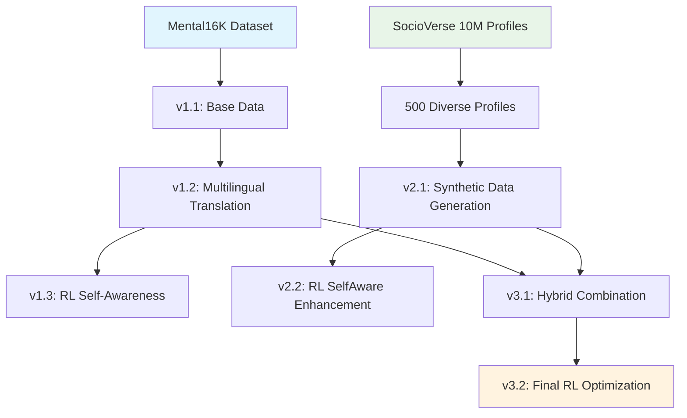

# Multilingual Mental Health Chatbot - COMP8420 Final Project

A comprehensive multilingual mental health chatbot built using fine-tuned Qwen3-4B models with novel Reinforcement Learning techniques for on-premise deployment.

## 📋 Table of Contents

- [Project Overview](#project-overview)
- [Chatbot](#chatbot)
- [Dataset Overview](#dataset-overview)
- [Data Preparation Pipeline](#data-preparation-pipeline)
- [Model Training](#model-training)
- [Inference & Evaluation](#inference--evaluation)
- [Project Structure](#project-structure)
- [Installation & Setup](#installation--setup)
- [Usage Guide](#usage-guide)
- [Results](#results)
- [Human Evaluation Survey](#-human-evaluation-survey)
- [Contributors](#contributors)


## 🎯 Project Overview

This project develops a multilingual mental health chatbot focusing on **distress detection** across multiple languages. We chose **Qwen3-4B** as our base model for its fast inference speed and suitability for on-premise deployment in healthcare settings.

### Key Features

- **Multilingual Support**: English, Vietnamese, Arabic, Cantonese, and Mandarin
- **On-Premise Solution**: Privacy-focused deployment for healthcare environments
- **Novel RL Approach**: Reinforcement Learning with Self-Awareness using GRPO
- **Comprehensive Evaluation**: 7-metric evaluation system for mental health responses

## 💬 Chatbot

The chatbot application and deployment scripts are located in the [`05_Chatbot`](./05_Chatbot) folder. For setup and usage instructions, please refer to the [05_Chatbot/README.md](./05_Chatbot/README.md).

## � Dataset Overview

This project utilizes multiple datasets across different phases of development, from foundational human conversations to synthetic data generation and hybrid combinations. All datasets are carefully curated and processed to ensure quality and cultural sensitivity.

### 🗂️ File paths of datasets
| Path | Description |
|---------|---------------|
|01_Building_Dataset/01_Phase_1_Human_Data_and_Translate/Interview_Data_6K.csv|Original dataset from Mental16k|
|01_Building_Dataset/01_Phase_1_Human_Data_and_Translate/01_Translated_data_by_LLM|Translated version of Mental16K|
|01_Building_Dataset/02_Phase_2_Synthetic_Data/00_Demographic_SocialVerse_Data|Inlcude 2 files: 10M user profile on X and samplin of 500 profiles|
|01_Building_Dataset/02_Phase_2_Synthetic_Data/04_output|Synthetic data output|
|01_Building_Dataset/02_Phase_2_Synthetic_Data/02_social_category.csv|Social category support for generting data|
|01_Building_Dataset/02_Phase_2_Synthetic_Data/02_culture_sensitive.md|Culture Characteristics Data|
|01_Building_Dataset/04_Final_dataset|Final dataset for training for 3 phases 7 models|
|03_Inference_from_Model/01_inference_result|Result of inference from 9 models - 7 trained model + 2 basesline on test sets of 200 multilingual questions|
|04_Evaluation/01_question_from_patients|Test sets includes questions from customers|
|04_Evaluation/03_evaluation_detailed_results_from_gpt_gemini|Detailed data of respones of answer judgment from GPT adn Gemini|


### 🗂️ Training Datasets

#### Phase 1: Foundation Human Data
| Dataset | File Location | Size | Languages | Description |
|---------|---------------|------|-----------|-------------|
| **Mental Health 6K** | `01_Building_Dataset/04_Final_dataset/Interview_Data_6K.csv` | ~6,000 conversations | English | Original human conversations between patients and mental health professionals from Mental16K dataset |
| **Multilingual Translated Data** | `01_Building_Dataset/04_Final_dataset/Translated_Data_5k_5_languages.csv` and other files in  | ~5,000 conversations × 5 languages | EN, VI, AR, ZH-CN, ZH-HK | AI-translated version of Mental16K to support multilingual training |

However, we then only take 1,000 sample per language (except English) to final dataset.

#### Phase 2: Synthetic Data Generation
| Dataset | File Location | Size | Languages | Description |
|---------|---------------|------|-----------|-------------|
| **Synthetic Interview Data** | `01_Building_Dataset/04_Final_dataset/stage_2_1_synthetic_interview_data_combined.csv` | 5,000 conversations | EN, VI, AR, ZH-CN, ZH-HK | Culturally-diverse synthetic conversations generated from 500 SocialVerse profiles across 33 psychology categories |

#### Phase 3: Hybrid Data Combination
| Dataset | File Location | Size | Languages | Description |
|---------|---------------|------|-----------|-------------|
| **Hybrid Training Data** | `01_Building_Dataset/04_Final_dataset/stage_3_1_hybrid_data.csv` | Optimized subset | EN, VI, AR, ZH-CN, ZH-HK | Final hybrid dataset used for training v3.1 and v3.2 models |

### 🧪 Evaluation Datasets

#### Test Questions Dataset
| Dataset | File Location | Size | Languages | Description |
|---------|---------------|------|-----------|-------------|
| **Original Test Questions** | `04_Evaluation/01_question_from_patients/question.jsonl` | 200 questions | English | Curated from Reddit posts by J Xu. et.al for mental health evaluation |
| **Multilingual Test Set** | `04_Evaluation/01_question_from_patients/sampled_multilingual_200.jsonl` | 200 questions (40 per language) | EN, VI, AR, ZH-CN, ZH-HK | Balanced multilingual test set for comprehensive evaluation |

### 🔧 Training Support Datasets

#### Formatting for RL Training
| Dataset | File Location | Size | Languages | Description |
|---------|---------------|------|-----------|-------------|
| **Format Training Samples** | `01_Building_Dataset/04_Final_dataset/generated_responses_60_samples.csv` | 60 samples | EN, VI, AR, ZH-CN, ZH-HK | Carefully formatted samples for teaching models proper response structure before RL training |

### 📊 Dataset Statistics Summary

| Phase | Total Conversations | Languages | Data Source | Training Versions |
|-------|-------------------|-----------|-------------|------------------|
| **Phase 1** | ~10,000 | 5 | Mental16K + Translations | v1.1, v1.2, v1.3 |
| **Phase 2** | 5,000 | 5 | SocialVerse + Synthetic Generation | v2.1, v2.2 |
| **Phase 3** | ~15,000 (optimized) | 5 | Hybrid Combination | v3.1, v3.2 |
| **Evaluation** | 200 questions | 5 | Reddit + Translations | All model testing |

### 🌍 Language Distribution

All training datasets maintain balanced representation across:
- **English (EN)**: Base language for original data
- **Vietnamese (VI)**: Southeast Asian cultural context
- **Arabic (AR)**: Middle Eastern cultural context  
- **Chinese Mandarin (ZH-CN)**: Simplified Chinese
- **Cantonese (ZH-HK)**: Traditional Chinese (Hong Kong)

### 🔄 Data Processing Pipeline

1. **Collection**: Mental16K human conversations + SocialVerse profiles
2. **Translation**: AI-powered multilingual translation with cultural adaptation
3. **Synthesis**: Generated diverse conversations using cultural-sensitive prompts
4. **Combination**: Strategic merging of real and synthetic data
5. **Optimization**: Quality filtering and balance adjustment
6. **Evaluation**: Multilingual test set creation and validation

### 📈 Data Quality Assurance

- **Human Curation**: 100+ samples manually reviewed for quality
- **Cultural Sensitivity**: Research-based cultural adaptation for each language
- **Balanced Demographics**: 500 diversified profiles ensuring representation
- **Professional Standards**: Mental health best practices maintained throughout
- **Statistical Sampling**: Methodologically sound sampling techniques applied

## �📊 Data Preparation Pipeline

### Phase 1: Foundation Data (v1.1 - v1.3)

#### Version 1.1: Base Mental Health Data
- **Source**: Mental16K dataset - real conversations between patients and mental health professionals
- **Size**: ~6,000 conversations (in English)
- **Purpose**: Establish baseline understanding of mental health counseling patterns

#### Version 1.2: Multilingual Translation
- **Process**: AI-powered translation of Mental16K to target languages
- **Languages**: Vietnamese, Arabic, Cantonese, Mandarin
- **Output**: `Translated_Data_5k_5_languages.csv`

#### Version 1.3: Reinforcement Learning with Self-Awareness
- **Innovation**: Novel GRPO (Group Relative Policy Optimization) with Self-Aware technique
- **Self-Awareness**: Model learns to assess its own response quality with 7-dimensional evaluation (active listening, safety, empathy, etc.)

### Phase 2: Synthetic Mental Heal Conversation Data Generation (v2.1 - v2.2)

#### Version 2.1: Diverse Synthetic Data
- **Foundation**: SocialVerse 10M user profiles (public dataset)
- **Sampling**: 500 diversified profiles with balanced demographics (sampling with statistics methodology)
- **Cultural Integration**: Culture-sensitive counseling approaches based on researchs about culture (Vietnamese, Arabic, Chinese). To avoid bias, we taking reputed papers and reduce by diversified backround with over 500 profile lead to diversified scenario.
- **Topics**: 33 psychology categories (Family, Work, Relationships, etc.)
- **Language**: 5 languages (English, Vietnamese, Madarin, Cantonese, Arabic)
- **Quality Control**: Human curation of 100+ random samples
- **Output**: `stage_2_1_synthetic_interview_data_combined.csv`
- **Size**: 5,000 sample

#### Version 2.2: RL Enhancement
- **Process**: Applied Reinforcement Learning with Self-Awareness to synthetic data
- **Improvement**: Enhanced response quality and cultural sensitivity

### Phase 3: Hybrid Data Integration (v3.1 - v3.2)

#### Version 3.1: Hybrid Dataset
- **Combination**: Merged Mental16k (English) translated real data (v1.2) with synthetic data (v2.1)
- **Output**: `stage_3_1_hybrid_data.csv`
- **Balance**: Optimal mix of authentic and diverse synthetic conversations

#### Version 3.2: Final RL Optimization
- **Final Enhancement**: Applied RL with Self-Awareness to hybrid dataset
- **Result**: Most comprehensive and culturally-aware training data

### Data Flow Diagram



## 🤖 Model Training

### Training Configuration
- **Base Model**: Qwen3-4B
- **LoRA Rank**: 64
- **Training Strategy**: Multi-stage learning
  1. **SFT (Supervised Fine-Tuning)**: 3 epochs
  2. **SFT with Formatting**: Format learning before RL (60 samples)
  3. **Reinforcement Learning**: 200 steps with GRPO
The novel **Reinforcement Learning with Self-Awareness** uses multiple reward functions to train the model:
        1. **`check_evaluation_format`** (Primary Reward):
        - **Score**: +5.0 for correct self-evaluation format
        - **Validation**: Checks for `<evaluate>...</evaluate>` tags with valid JSON
        - **Structure**: Validates 7 mental health metrics + explanation
        - **Bonus**: +3.0 for complete structure, +2.0 for valid score ranges (1-10)
        - **Penalty**: -1.0 for invalid JSON, -3.0 for missing evaluation

        2. **`check_no_extra_text`** (Secondary Reward):
        - **Score**: +2.0 for clean responses without extra text after evaluation
        - **Purpose**: Ensures model follows strict formatting guidelines
        - **Penalty**: -2.0 for additional text after `</evaluate>`

        3. **`check_language_consistency`** (Tertiary Reward):
        - **Score**: +1.0 for matching input language in response
        - **Detection**: Uses language detection to verify consistency
        - **Multilingual**: Critical for maintaining language-specific responses

        4. **`check_no_repetition`** (Quaternary Reward):
        - **Score**: +1.0 for unique, non-repetitive content
        - **Analysis**: Sentence-level repetition detection
        - **Penalty**: -2.0 for >30% repetitive content
        - **Quality**: Ensures response diversity and coherence

        5. **`debug_responses`** (Monitoring Function):
        - **Purpose**: Real-time monitoring during training
        - **Tracking**: Response quality, format compliance, language consistency
        - **Logging**: Detailed debugging information for training analysis

        #### Self-Evaluation Metrics (Required in JSON):
        - **Active Listening**: Demonstrates understanding and reflection
        - **Empathy & Validation**: Shows emotional understanding  
        - **Safety & Trustworthiness**: Maintains appropriate boundaries
        - **Openness & Non-judgment**: Creates safe environment
        - **Clarity & Encouragement**: Provides clear communication
        - **Boundaries & Ethical**: Maintains professional standards
        - **Holistic Approach**: Considers whole-person wellness
        - **Explanation for Scoring**: Rationale for self-assessment

        #### Training Configuration:
        - **Learning Rate**: 1e-6 (lower for fine-tuning stability)
        - **Batch Size**: 4 per device with gradient accumulation
        - **Temperature**: 0.8 for balanced creativity/consistency
        - **Max Steps**: 200 for efficient convergence
        - **Optimizer**: AdamW 8-bit for memory efficiency 

### Model Versions Trained
1. **v1.1**: Base mental health data
2. **v1.2**: Continue Training from v1.1 with Multilingual translated data
3. **v1.3**: Continue RL-enhanced multilingual data
4. **v2.1**: Synthetic data training
5. **v2.2**: RL-enhanced synthetic data
6. **v3.1**: Hybrid data training
7. **v3.2**: Final RL-enhanced hybrid model

### Training Features
- **Multi-stage Learning**: SFT → Format Learning → Reinforcement Learning
- **Self-Aware Evaluation**: Model learns 7 counseling metrics
- **Cultural Sensitivity**: Language-specific training approaches
- **Wandb Integration**: Comprehensive experiment tracking

## 🔍 Inference & Evaluation

### Inference Pipeline
- **Models Tested**: 7 fine-tuned models + 2 baseline models (Samantha 1.11, 1.12)
- **Framework**: VLLM for efficient inference
- **Output Format**: Structured responses with confidence metrics

### Evaluation Methodology

#### Step 1: Test Set Creation
- **Source**: 200 questions source from Reddit, curated by J Xu. et.al
- **Translation**: Multi-language test set creation
- **Coverage**: Diverse mental health scenarios
- **Final Version**: Each languge will contribute 40 questions to total of 200 questions.

#### Step 2: Model Response Generation
- **Process**: All 9 models generate responses to test questions
- **Format**: Consistent output structure across models
- **Languages**: Testing across all supported languages

#### Step 3: Automated Evaluation
- **Evaluators**: GPT-4.1-mini and Gemini Flash 2.0
- **Scale**: 1-10 scoring system
- **Metrics**:
  - Active Listening
  - Empathy & Validation
  - Safety & Trustworthiness
  - Openness & Non-judgment
  - Clarity & Encouragement
  - Boundaries & Ethics
  - Holistic Approach

#### Step 4: Statistical Analysis
- **Aggregation**: Combined GPT-4 and Gemini scores
- **Statistics**: Mean, median, standard deviation per metric
- **Comparison**: Cross-model performance analysis

## 📁 Project Structure

```
mq-nlp-group-repo/
├── 01_Building_Dataset/
│   ├── 01_Phase_1_Human_Data_and_Translate/
│   │   ├── 01_translate_csv_efficient.py
│   │   ├── 02_combine_csv_files.py
│   │   └── Interview_Data_6K.csv
│   ├── 02_Phase_2_Synthetic_Data/
│   │   ├── generate_synthetic_data.py
│   │   ├── 03_run_generator.py
│   │   ├── 02_culture_sensitive.md
│   │   └── requirements.txt
│   ├── 03_Hybrid_Data/
│   │   └── combine_3_datasets.py
│   └── 04_Final_dataset/
│       ├── Interview_Data_6K.csv
│       ├── Translated_Data_5k_5_languages.csv
│       ├── stage_2_1_synthetic_interview_data_combined.csv
│       └── stage_3_1_hybrid_data.csv
├── 02_Training_Code/
│   ├── Phase_1-Training_3_model_series_1-v1.1-v1.2-v1.3.ipynb
│   ├── Phase_2-Training_2_model_series_2-v2.1-v2.2.ipynb
│   ├── Phase_3-Training_2_model_series_3-v3.1-v3.2.ipynb
│   └── dataset/
├── 03_Inference_from_Model/
│   ├── 01_samantha_vllm_inference.py
│   ├── 02_lora_model_vllm_inference.py
│   └── 03_convert_vllm_results.py
├── 04_Evaluation/
│   ├── 01_01_translate_question_in_jsonl.py
│   ├── 01_02_sampling_multilingual_dataset.py
│   ├── 03_01_evaluate_lora_model_responses.py
│   ├── 03_02_evaluate_base_model_responses.py
│   ├── 04_combine_evaluation_statistics.py
│   └── 04_combined_evaluation_statistics.csv
└── README.md
```

## ⚙️ Installation & Setup

### Prerequisites
- Python 3.10+
- CUDA-capable GPU (recommended)
- 40GB+ VRAM (for GPU)
- 64GB+ RAM

### Environment Setup

```bash
# Clone the repository
git clone <repository-url>
cd mq-nlp-group-repo

# Install dependencies for data generation
cd 01_Building_Dataset/02_Phase_2_Synthetic_Data
pip install -r requirements.txt

# Install dependencies for traning
cd ../../02_Training_Code
pip install -r requirements.txt

# Install evaluation dependencies
cd ../../04_Evaluation
pip install -r evaluation_requirements.txt

# Set up API keys
export OPENAI_API_KEY='your-openai-key'
export GEMINI_API_KEY='your-gemini-key'
```

### Model Setup
```bash
# Download base model (if needed)
huggingface-cli download Qwen/Qwen3-4B
huggingface-cli cognitivecomputations/Samantha-1.11-7b
huggingface-cli cognitivecomputations/samantha-1.2-mistral-7b

# Set up VLLM for inference
pip install vllm
```

## 🚀 Usage Guide

### 1. Data Generation

#### Generate Synthetic Data
```bash

# Phase 1
python 01_Building_Dataset/01_Phase_1_Human_Data_and_Translate/01_translate_csv_efficient.py

# Phase 2 - Synthetic data
python 01_Building_Dataset/01_Phase_1_Human_Data_and_Translate/02_combine_csv_files.py
python  01_Building_Dataset/02_Phase_2_Synthetic_Data/01-Build_Patient_Profile-diverse_sampling_500_patients.py
python 01_Building_Dataset/02_Phase_2_Synthetic_Data/03_run_generator.py
python 01_Building_Dataset/02_Phase_2_Synthetic_Data/04_convert_json_to_csv.py

# Phase 3 Combine Datasets
python 01_Building_Dataset/03_Hybrid_Data/combine_3_datasets.py
```


### 2. Model Training

Open the 3 training notebooks and execute steps by steps in Jupyter:

```
Phase_1-Training_3_model_series_1-v1.1-v1.2-v1.3.ipynb
Phase_2-Traning_2_model_series_2-v2.1-v2.2.ipynb
Phase_3-Traning_2_model_series_3-v3.1-v3.2.ipynb
```

To download the trained model, please access https://1drv.ms/f/s!Aux-k3Gku6y6spVl4-Edg4kJRfxk0Q?e=5RnppU

### 3. Model Inference

#### Run inference on trained models

Input the trained model name in the file below and run it.
```bash
cd 03_Inference_from_Model
python 02_lora_model_vllm_inference.py
```

#### Run baseline model inference

Input the trained model name in the file below and run it for Samathan 1.11 and Samathan 1.2
```bash
python 01_samantha_vllm_inference.py
```

### 4. Evaluation

#### Evaluate model responses

Evaluate for trained model, please input the filename of inferenced file from model.
```bash
cd 04_Evaluation
python 03_01_evaluate_lora_model_responses.py
```

Evaluate for trained model, please input the filename of inferenced file from model.
```bash
cd 04_Evaluation
python 03_01_evaluate_lora_model_responses.py
python 03_02_evaluate_base_model_responses.py
```

#### Combine results
```bash
python 04_combine_evaluation_statistics.py
```

## 📈 Results

### Model Performance Summary

| Model                 | Active Listening ↑ |  | Empathy & Validation ↑ |  | Safety & Trustworthiness ↑ |  | Open-mindedness & Non-judgement ↑ |  | Clarity & Encouragement ↑ |  | Boundaries & Ethical ↑ |  | Holistic Approach ↑ |  | Average GPT Score ↑ |  | Average Score ↑ |  |
|-----------------------|-------------------|----|-----------------------|----|---------------------------|----|--------------------------------|----|--------------------------|----|-----------------------|----|-------------------|----|---------------------|----|-----------------|----|
|                       | GPT               | Gemini | GPT                  | Gemini | GPT                      | Gemini | GPT                           | Gemini | GPT                     | Gemini | GPT                  | Gemini | GPT              | Gemini | GPT                | Gemini | GPT            | Gemini |
| Samantha-V1.1 $       | 5.66              | 6.78  | 5.78                 | 6.86  | 6.38                     | 7.50  | 7.70                          | 8.42  | 6.48                    | 6.88  | 5.34                 | 7.80  | 4.92             | 5.74  | 5.90               | 6.44  | 5.90           | 6.17  |
| Samantha-V1.2 $       | 6.60              | 6.88  | 6.92                 | 6.94  | 7.14                     | 7.78  | 8.06                          | 8.66  | 7.04                    | 7.02  | 6.58                 | 7.84  | 5.68             | 6.00  | 6.68               | 6.68  | 6.68           | 6.68  |
| Qwen-Human (v1.1)     | 7.36              | 7.63  | 7.41                 | 7.80  | 7.17                     | 7.64  | 8.37                          | 8.80  | 7.27                    | 7.18  | 5.91                 | 7.28  | 6.59             | 6.79  | 7.08               | 7.02  | 7.08           | 7.05  |
| Qwen-Human-SynMulti (v1.2) | 7.13          | 7.37  | 7.25                 | 7.42  | 7.08                     | 7.57  | 8.11                          | 8.40  | 6.74                    | 6.87  | 6.18                 | 7.37  | 6.78             | 6.66  | 6.93               | 6.83  | 6.93           | 6.88  |
| Qwen-Human-SynMulti-RL-v1.3 | 7.84         | 7.97  | 7.98                 | 8.03  | 8.15                     | 8.07  | 8.56                          | 8.77  | 7.30                    | 7.31  | 7.16                 | 7.80  | 7.06             | 7.04  | 7.56               | 7.38  | 7.47           | 7.47  |
| Qwen-SyntheticMulti (v2.1) | 8.13          | 8.09  | 7.70                 | 7.90  | 7.79                     | 8.19  | 8.74                          | 8.90  | 7.59                    | 7.44  | 6.59                 | 7.48  | 7.28             | 7.43  | 7.67               | 7.58  | 7.58           | 7.62  |
| Qwen-SyntheticMulti-RL (v2.1) | 8.14        | 8.07  | 8.19                 | 8.17  | 8.10                     | 8.41  | 8.77                          | 8.91  | 7.35                    | 7.25  | 7.56                 | 7.61  | 7.23             | 7.23  | 7.85               | 7.48  | 7.66           | 7.66  |
| Qwen-Hybrid (v3.1)    | 8.23              | 8.26  | 8.20                 | 8.37  | 8.38                     | 8.49  | 8.67                          | 9.03  | 7.38                    | 7.39  | 7.61                 | 8.24  | 7.45             | 7.29  | 7.83               | 7.69  | 7.69           | 7.76  |
| Qwen-Hybrid - RL (v3.2) | 8.32          | 8.21  | 8.44                 | 8.45  | 8.56                     | 8.50  | 8.80                          | 9.03  | 7.76                    | 7.57  | 7.90                 | 8.18  | 7.66             | 7.36  | 8.05               | 7.79 ⭐ | 7.92 ⭐          | 7.92 ⭐  |


### Key Findings

1. **Progressive Improvement**: Each training phase showed measurable improvements
2. **RL Effectiveness**: Self-aware RL consistently improved model performance even with **no new data** just by self-aware of metrics.
3. **Hybrid Data Success**: Combining real and synthetic data (v3.1/v3.2) achieved best results
4. **Cultural Adaptation**: Multilingual models showed better cultural sensitivity
5. **On-Premise Viability**: Qwen3-4B proved effective for healthcare deployment with small size, fast inference and easy to dpeloy

### Evaluation Metrics Explained

- **Active Listening**: Demonstrates understanding and reflection of patient concerns
- **Empathy & Validation**: Shows emotional understanding and validation
- **Safety & Trustworthiness**: Maintains appropriate boundaries and safety
- **Openness & Non-judgment**: Creates safe, non-judgmental environment
- **Clarity & Encouragement**: Provides clear, encouraging communication
- **Boundaries & Ethics**: Maintains professional therapeutic boundaries
- **Holistic Approach**: Considers whole-person wellness

## 📝 Human Evaluation Survey

To complement automated evaluation, we conducted a human evaluation survey to assess the model's response quality from a user perspective. The survey gathers feedback on empathy, clarity, cultural sensitivity, and overall helpfulness.

- **Survey Location**: [`04_Evaluation/02_human_evaluation_survey`](./04_Evaluation/02_human_evaluation_survey)
- **Contents**: Survey form, instructions, and anonymized response data
- **Purpose**: Collect qualitative insights and validate AI-based evaluation metrics

**How to Participate:**
1. Open the survey form in the folder above.
2. Follow the instructions to review sample chatbot responses.
3. Submit your ratings and feedback as described in the README.

Results from the human evaluation are used to further refine and benchmark the chatbot's performance.

## 🏆 Key Innovations

1. **Reinforcement Learning with Self-Awareness**: Novel approach using GRPO for mental health applications
2. **Cultural Sensitivity Integration**: Systematic approach to cross-cultural mental health support
3. **Hybrid Data Strategy**: Combining real conversations with culturally-diverse synthetic data
4. **Multi-stage Training**: SFT → Format Learning → RL pipeline
5. **Comprehensive Evaluation**: 7-metric evaluation system with dual AI evaluators

## 👥 Contributors

- **Project Team**: COMP8420 Natural Language Processing Course
- **Institution**: Macquarie University
- **Focus**: Multilingual Mental Health Technology

## 📄 License

This project is developed for academic purposes as part of COMP8420 coursework.


**Note**: This project is designed for research and educational purposes. Any deployment in clinical settings should involve qualified mental health professionals and undergo appropriate ethical review.
