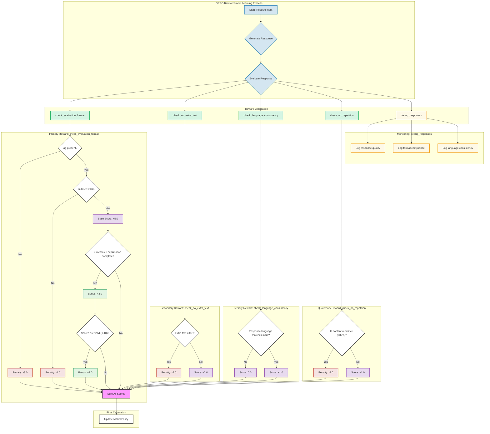

### Reinforcement Learning Reward Function Architecture

```mermaid
graph TD
    subgraph GRPO Reinforcement Learning Process
        A[Start: Receive Input] --> B{Generate Response};
        B --> C{Evaluate Response};
    end

    subgraph Reward Calculation
        C --> R1[check_evaluation_format];
        C --> R2[check_no_extra_text];
        C --> R3[check_language_consistency];
        C --> R4[check_no_repetition];
        C --> D[debug_responses];
    end

    subgraph "Primary Reward: check_evaluation_format"
        R1 --> R1_C1{"<evaluate> tag present?"};
        R1_C1 -- No --> R1_P1[Penalty: -3.0];
        R1_C1 -- Yes --> R1_C2{Is JSON valid?};
        R1_C2 -- No --> R1_P2[Penalty: -1.0];
        R1_C2 -- Yes --> R1_S1[Base Score: +5.0];
        
        R1_S1 --> R1_C3{"7 metrics + explanation complete?"};
        R1_C3 -- Yes --> R1_B1[Bonus: +3.0];
        R1_C3 -- No --> TotalReward;

        R1_B1 --> R1_C4{"Scores are valid (1-10)?"};
        R1_C4 -- Yes --> R1_B2[Bonus: +2.0];
        R1_C4 -- No --> TotalReward;
    end

    subgraph "Secondary Reward: check_no_extra_text"
        R2 --> R2_C1{"Extra text after </evaluate>?"};
        R2_C1 -- Yes --> R2_P1[Penalty: -2.0];
        R2_C1 -- No --> R2_S1[Score: +2.0];
    end

    subgraph "Tertiary Reward: check_language_consistency"
        R3 --> R3_C1{"Response language matches input?"};
        R3_C1 -- No --> R3_S1_No[Score: 0.0];
        R3_C1 -- Yes --> R3_S1_Yes[Score: +1.0];
    end

    subgraph "Quaternary Reward: check_no_repetition"
        R4 --> R4_C1{"Is content repetitive (>30%)?"};
        R4_C1 -- Yes --> R4_P1[Penalty: -2.0];
        R4_C1 -- No --> R4_S1[Score: +1.0];
    end

    subgraph "Monitoring: debug_responses"
        D --> D1[Log response quality];
        D --> D2[Log format compliance];
        D --> D3[Log language consistency];
    end

    subgraph Final Calculation
        style TotalReward fill:#f9f,stroke:#333,stroke-width:2px
        
        %% Connections to Total Reward
        R1_P1 --> TotalReward;
        R1_P2 --> TotalReward;
        R1_B2 --> TotalReward;
        R2_S1 --> TotalReward;
        R2_P1 --> TotalReward;
        R3_S1_Yes --> TotalReward;
        R3_S1_No --> TotalReward;
        R4_S1 --> TotalReward;
        R4_P1 --> TotalReward;

        TotalReward[Sum All Scores] --> Update[Update Model Policy];
    end

    %% Styling
    classDef default fill:#fff,stroke:#333,stroke-width:2px;
    classDef process fill:#d4e6f1,stroke:#2980b9,stroke-width:2px;
    classDef reward fill:#d5f5e3,stroke:#28b463,stroke-width:2px;
    classDef penalty fill:#f5e3e3,stroke:#c0392b,stroke-width:2px;
    classDef bonus fill:#e3f5e3,stroke:#229954,stroke-width:2px;
    classDef score fill:#e8daef,stroke:#8e44ad,stroke-width:2px;
    classDef monitor fill:#fef9e7,stroke:#f39c12,stroke-width:2px;

    class A,B,C process;
    class R1,R2,R3,R4 reward;
    class R1_P1,R1_P2,R2_P1,R4_P1 penalty;
    class R1_B1,R1_B2 bonus;
    class R1_S1,R2_S1,R3_S1_Yes,R3_S1_No,R4_S1 score;
    class D,D1,D2,D3 monitor;
```