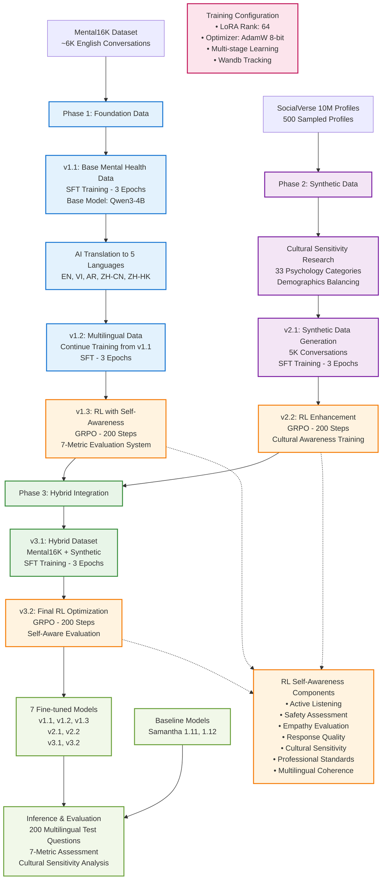

### Training Pipeline Flowchart

```mermaid
graph TD
    %% Data Sources
    A[Mental16K Dataset<br/>~6K English Conversations] --> B[Phase 1: Foundation Data]
    A1[SocialVerse 10M Profiles<br/>500 Sampled Profiles] --> C[Phase 2: Synthetic Data]
    
    %% Phase 1: Foundation Data
    B --> B1[v1.1: Base Mental Health Data<br/>SFT Training - 3 Epochs<br/>Base Model: Qwen3-4B]
    B1 --> B2[AI Translation to 5 Languages<br/>EN, VI, AR, ZH-CN, ZH-HK]
    B2 --> B3[v1.2: Multilingual Data<br/>Continue Training from v1.1<br/>SFT - 3 Epochs]
    B3 --> B4[v1.3: RL with Self-Awareness<br/>GRPO - 200 Steps<br/>7-Metric Evaluation System]
    
    %% Phase 2: Synthetic Data
    C --> C1[Cultural Sensitivity Research<br/>33 Psychology Categories<br/>Demographics Balancing]
    C1 --> C2[v2.1: Synthetic Data Generation<br/>5K Conversations<br/>SFT Training - 3 Epochs]
    C2 --> C3[v2.2: RL Enhancement<br/>GRPO - 200 Steps<br/>Cultural Awareness Training]
    
    %% Phase 3: Hybrid Integration
    B4 --> D[Phase 3: Hybrid Integration]
    C3 --> D
    D --> D1[v3.1: Hybrid Dataset<br/>Mental16K + Synthetic<br/>SFT Training - 3 Epochs]
    D1 --> D2[v3.2: Final RL Optimization<br/>GRPO - 200 Steps<br/>Self-Aware Evaluation]
    
    %% Training Configuration Details
    E[Training Configuration<br/>• LoRA Rank: 64<br/>• Optimizer: AdamW 8-bit<br/>• Multi-stage Learning<br/>• Wandb Tracking]
    
    %% Final Models
    D2 --> F[7 Fine-tuned Models<br/>v1.1, v1.2, v1.3<br/>v2.1, v2.2<br/>v3.1, v3.2]
    
    %% Evaluation
    F --> G[Inference & Evaluation<br/>200 Multilingual Test Questions<br/>7-Metric Assessment<br/>Cultural Sensitivity Analysis]
    
    %% Baseline Comparison
    H[Baseline Models<br/>Samantha 1.11, 1.12] --> G
    
    %% RL Self-Awareness Details
    I[RL Self-Awareness Components<br/>• Active Listening<br/>• Safety Assessment<br/>• Empathy Evaluation<br/>• Response Quality<br/>• Cultural Sensitivity<br/>• Professional Standards<br/>• Multilingual Coherence]
    
    %% Connections to RL Components
    B4 -.-> I
    C3 -.-> I
    D2 -.-> I
    
    %% Styling
    classDef phase1 fill:#e3f2fd,stroke:#1976d2,stroke-width:2px
    classDef phase2 fill:#f3e5f5,stroke:#7b1fa2,stroke-width:2px
    classDef phase3 fill:#e8f5e8,stroke:#388e3c,stroke-width:2px
    classDef rl fill:#fff3e0,stroke:#f57c00,stroke-width:2px
    classDef config fill:#fce4ec,stroke:#c2185b,stroke-width:2px
    classDef eval fill:#f1f8e9,stroke:#689f38,stroke-width:2px
    
    class B,B1,B2,B3,B4 phase1
    class C,C1,C2,C3 phase2
    class D,D1,D2 phase3
    class B4,C3,D2,I rl
    class E config
    class F,G,H eval
```